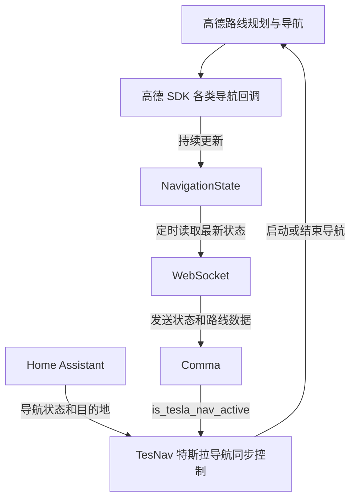

# TesNav

TesNav 提供 Android 和 iOS 手机端导航应用。两端使用高德地图与导航 SDK
进行地址搜索、路线规划和实时导航，并通过局域网自动发现 C3XL，将经过签名的
高层导航状态发送给 NavAssist；不需要共享 Token。

## 主要功能

- Android 可在高德地图上长按选择目的地；Android/iOS 都可输入地址或地点、选择模糊搜索结果并规划路线
- 显示当前位置的逆地理编码地址；尚无定位或地址服务失败时显示明确状态
- 两端都支持最多三条路线、实时/模拟导航、暂停/继续模拟、结束导航、内置语音和静音/恢复
- Android 通过前台服务，iOS 通过后台定位/音频模式维持导航和 NavAssist 连接
- 两端都使用 P-256 身份自动发现并配对 tici，支持查看连接状态和忘记配对，不需要共享 Token
- 两端使用相同的 v3 maneuver、匝道/出口、车道动作、推荐车道、GPS 诊断和回调时间语义
- 汇总位置、车速、剩余距离、剩余时间、道路、车道、摄像头、限速和交通状态
- 通过 WebSocket 定时向 Comma 端发送最新导航快照
- 路线规划完成后发送经过简化的全量路线坐标
- 接收 Comma 返回的 `is_tesla_nav_active` 状态
- 订阅 Home Assistant 中的特斯拉导航状态与目的地，实现导航同步
- 在设置页面查看 Comma、Home Assistant、导航错误及路线简化结果

## 运行时流程



导航过程中，高德 SDK 回调持续更新最新导航状态，WebSocket 再将状态和路线数据发送给 Comma。TesNav 同时结合 Home Assistant 的目的地和 Comma 的导航激活状态，实现特斯拉导航同步。

## 本地配置

真实 Key 和 Token 不保存在仓库中。请在本机用户级 Gradle 配置文件中填写：

```text
~/.gradle/gradle.properties
```

示例：

```properties
# 必填：高德 Android 平台 Key

AMAP_API_KEY=xxxx
HOME_ASSISTANT_URL=http://192.168.1.2:8123
HOME_ASSISTANT_TOKEN=xxxx

```

当前 NavAssist v3 默认使用 UDP 7765 自动发现和 TCP 7766 签名快照，不需要 URL
或共享 Token。Android/iOS 能力契约见
[`docs/PLATFORM_PARITY.md`](docs/PLATFORM_PARITY.md)。

## 构建与安装

克隆仓库并进入项目目录：

```bash
git clone git@github.com:USERNAME/TesNav.git
cd TesNav
```

构建 Debug APK：

```bash
./gradlew assembleDebug
```

生成的 APK 位于：

```text
app/build/outputs/apk/debug/app-debug.apk
```

也可以直接使用 Android Studio 打开项目并运行到 Android 设备。

iOS 工程位于 [`ios/`](ios/README.md)，使用 XcodeGen 与 CocoaPods 生成，支持
模糊地址搜索、当前地址、多路线、实时/模拟语音导航、后台播报和 tici v3
自动发现。iOS 高德 Key 必须绑定 Bundle ID `com.garan.tesnav.ios`。

首次启动时需要授予定位、后台定位和通知等权限。进入地图后长按目标位置，再点击“导航到这里”即可规划路线。

## 凭据说明

仓库只包含 Gradle 属性名称，不包含真实高德 Key、Home Assistant Token 或 WebSocket Token。每位开发者需要在自己的 `~/.gradle/gradle.properties` 中配置这些值。项目的 `.gitignore` 已排除 `local.properties` 和构建目录。
