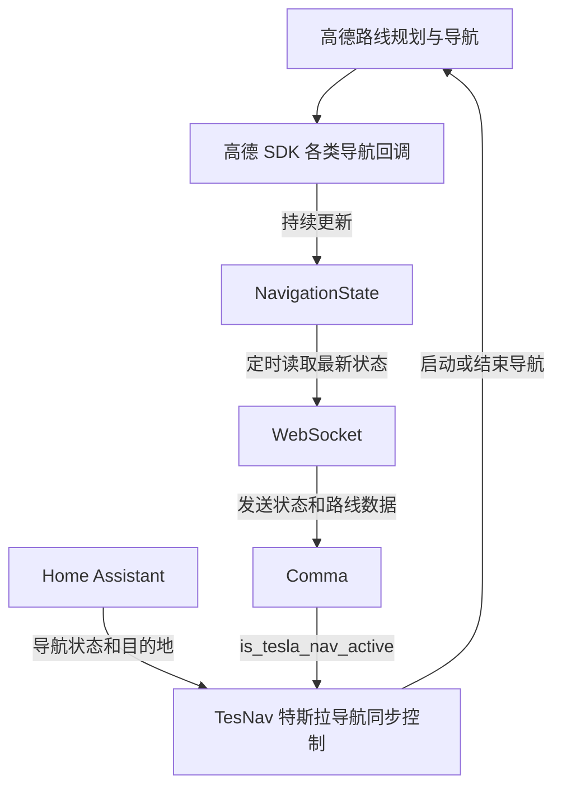

# TesNav

TesNav 是一个面向车载 Android 设备的导航应用。它使用高德地图与导航 SDK 提供地图选点、路线规划、实时导航和模拟导航，并将当前导航状态与路线数据通过 WebSocket 发送给 Comma 端。同时，应用可以读取 Home Assistant 中的特斯拉导航状态和目的地，在特斯拉开始导航时自动规划同一目的地。

## 主要功能

- 在高德地图上长按选择目的地并规划路线
- 在主地图页输入地址或地点搜索目的地，并在地图上二次确认后规划路线
- 显示当前位置的逆地理编码地址；尚无定位或地址服务失败时显示明确状态
- 支持实时导航、模拟导航、暂停、继续和结束导航
- 通过前台服务在后台维持导航状态和网络连接
- 汇总位置、车速、剩余距离、剩余时间、道路、车道、摄像头、限速和交通状态
- 通过 WebSocket 定时向 Comma 端发送最新导航快照
- 路线规划完成后发送经过简化的全量路线坐标
- 接收 Comma 返回的 `is_tesla_nav_active` 状态
- 订阅 Home Assistant 中的特斯拉导航状态与目的地，实现导航同步
- 在设置页面查看 Comma、Home Assistant、导航错误及路线简化结果

## 运行时流程



导航过程中，高德 SDK 回调持续更新最新导航状态，WebSocket 再将状态和路线数据发送给 Comma。TesNav 同时结合 Home Assistant 的目的地和 Comma 的导航激活状态，实现特斯拉导航同步。

## 本地配置

真实 Key 和 Token 不保存在仓库中。请在本机用户级 Gradle 配置文件中填写：

```text
~/.gradle/gradle.properties
```

示例：

```properties
# 必填：高德 Android 平台 Key

AMAP_API_KEY=xxxx
HOME_ASSISTANT_URL=http://192.168.1.2:8123
HOME_ASSISTANT_TOKEN=xxxx

```

可选的 NavAssist v2 手机到 C3XL 单向 HTTP 出口默认关闭；只有同时配置
`NAV_ASSIST_V2_URL` 与 `NAV_ASSIST_V2_TOKEN` 才会启动。协议、HMAC、字段新鲜度和
兼容性约定见 [`docs/NAVASSIST_V2.md`](docs/NAVASSIST_V2.md)。原 WebSocket v1
配置和默认行为不受影响。

## 构建与安装

克隆仓库并进入项目目录：

```bash
git clone git@github.com:USERNAME/TesNav.git
cd TesNav
```

构建 Debug APK：

```bash
./gradlew assembleDebug
```

生成的 APK 位于：

```text
app/build/outputs/apk/debug/app-debug.apk
```

也可以直接使用 Android Studio 打开项目并运行到 Android 设备。

首次启动时需要授予定位、后台定位和通知等权限。进入地图后长按目标位置，再点击“导航到这里”即可规划路线。

## 凭据说明

仓库只包含 Gradle 属性名称，不包含真实高德 Key、Home Assistant Token 或 WebSocket Token。每位开发者需要在自己的 `~/.gradle/gradle.properties` 中配置这些值。项目的 `.gitignore` 已排除 `local.properties` 和构建目录。
